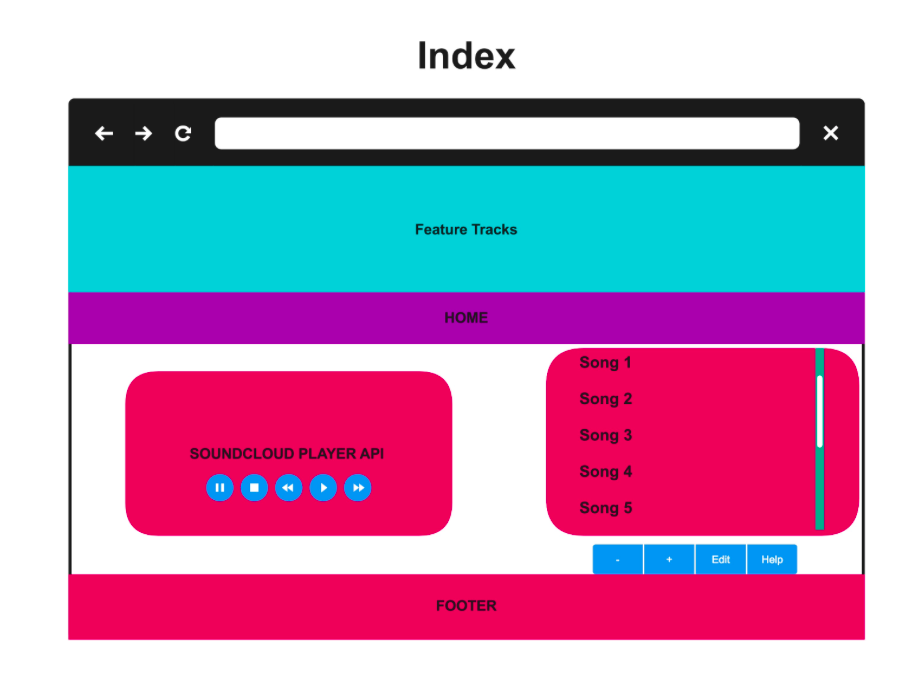
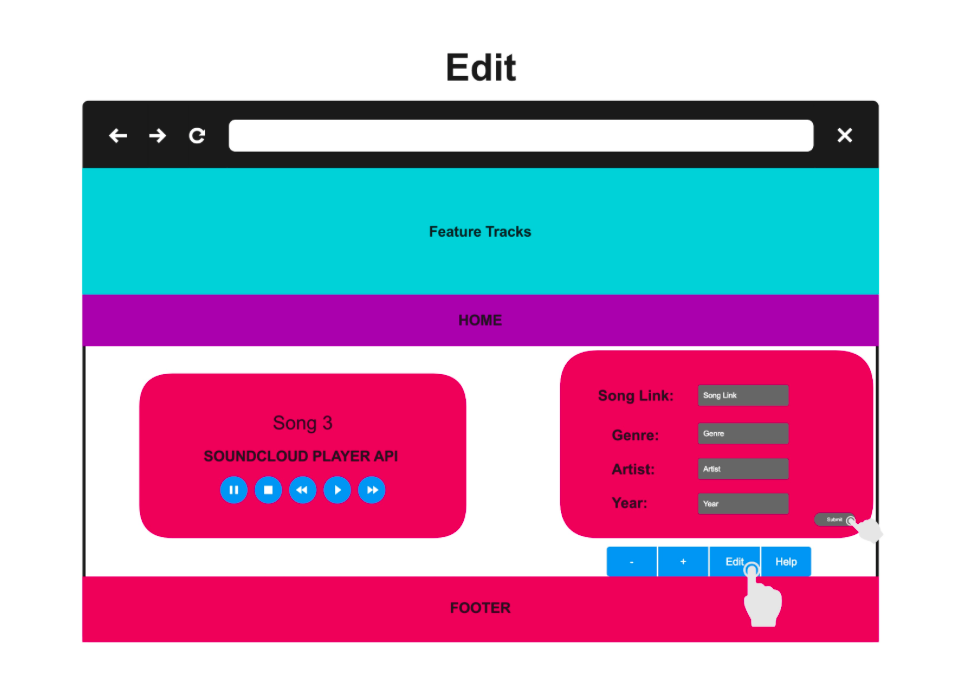

# Project 3 Music Player 

### User Story 

#### Help

#### User clicks the help button and then hovers over a UI element to see a brief description of the element displayed as a box next to the element.

#### Index

##### When the page loads, the user will see a "featured tracks" hero/jumbotron, a nav bar, and a playlist of songs from our database.

#### Edit

##### When the user clicks the edit button, and then clicks a song from the song list, a form will drop down over the song list and they will be able to edit the values for the specified song.When the user clicks save the song will be updated to db.

#### Add

##### When user clicks the add button denoted by a plus symbol, a form will drop down over the song list where the user can enter in data for artist,song url,song name. When the user clicks the save button, the form data will be saved as a new song.

#### Delete

##### When the user clicks the delete button denoted by the minus symbol, "x" buttons will appear next to each song in the song list. When the user clicks an "x" button, the song that it is next to will be deleted from the song list.

#### Feature Tracks

##### When the user clicks one of the featured tracks slides, the music player will play the song that was clicked.

Artist.                       
 
 | id       |   artist     |
 |---------:|-------------:|
 |   1      |  beyonce     |
 |   2      |  coldplay    |
 |   3      |  drake       |
  

 Playlist.

 | id |   song           | artist_id   |          src                 | 
 |----|:----------------:|------------:|-----------------------------:|    
 |  1 | single ladies    |     1       | src code here                |
 |  2 | viva la vida     |     2       | src code here                |
 |  3 | one dance        |     3       | src code here                |
 
=======
# readme

